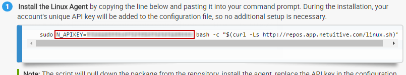

# Installation Methods

## Standard Installation <a id="bkmrk-page-title"></a>

### Get Command From Linux Integration Setup Page

1. From the top navigation menu, select **Integrations**.
2. Select the **Linux** card. The name should be already populated, and _Data Collection_ should be enabled.
3. Highlight the one-line install command from the instructions and copy them. A unique API key for your account has already been generated and included in the command line.



### **Specifying the Element Name**

If you’d prefer to specify the element name, copy the following instead:1

```text
sudo N_APIKEY=your-apikey N_HOSTNAME=your-element-name bash -c "$(curl -Ls http://repos.app.netuitive.com/linux.sh)"
```

`your-apikey` is the API key generated from the integration and `your-element-name` can be any element name you wish \(it must be unique from your other elements\).

### Install Linux Agent 

Paste the command from the previous section into your command line. This installs the agent and adds your account’s unique API key to the configuration file. Prefer to install manually? See our [Manual Installation](http://54.172.193.4:8080/books/linux-agent/page/manual-installation) page. 

If you install our Linux Agent on an AWS EC2 or Azure VM, the EC2’s / VM’s power state \(it will come in as the attribute `hostRunning` with a value of `true` or `false`\) and tags are copied over to the corresponding Linux SERVER element. You can then use this information to create policies.

### Edit Linux Agent Config File

1. Navigate to the Linux Agent configuration file found at `<b>/opt/netuitive-agent/conf/netuitive-agent.conf</b>`.
2. Ensure the API key provided in step 1 is input in the _netuitive-agent.conf_ file. The section below is only a portion of the config file. Go [here](https://raw.githubusercontent.com/netuitive/omnibus-netuitive-agent/master/netuitive/conf/netuitive-agent.conf) to view the full config file.  


   \[\[NetuitiveHandler\]\]

   ```bash
   ### MetriclyCloud URL to post the metrics
   url = https://api.app.metricly.com/ingest/infrastructure

   ## Metricly Datasource api key
   api_key = 

   ### Uncomment to add tags (optional)
   # tags = tag1:tag1val, tag2:tag2val

   ### Uncomment to add relations
   # relations = element1, element2

   # How many samples to store before sending to Metricly
   batch = 100

   # how many batches to store before trimming
   max_backlog_multiplier = 5

   # Trim down how many batches
   trim_backlog_multiplier = 4

   # local statsd server
   [[[statsd]]]
   enabled = False
   ```

3. Options:
   * **Tags**:  Substitute _tags_ value with desired tags and uncomment the line to pass in tags for your element.
   * **Relations**:  Substitute _relations_ value with desired element relationships; must include the fully qualified name of the elements. Uncomment the line to pass in relationships for your element.
   * **Collectors**: Adjust  default collectors \(CPU, DiskSpace, DiskUsage, Heartbeat, LoadAverage, Memory, VMStat, Network\) using the configuration options found [here](https://www.metricly.com/support/integrations/linux/#additional-configuration-options).
4. **Save** your file.
5. **Restart** the Linux Agent service to begin monitoring your data with Metricly.

This integration’s package \(computed metrics, dashboards, and policies that will give you important events and alerts\) will be automatically enabled and provisioned to your account as soon as Metricly receives data from the integration.

The _PACKAGES_ button on the integration setup page will become active once data is received, so you’ll be able to disable and re-enable the package at will.

### Common Commands

* `service netuitive-agent {stop|start|restart}`
* `/etc/init.d/netuitive-agent {stop|start|restart}`
* `initctl {stop|start|restart} netuitive-agent`
* `systemctl {stop|start|restart} netuitive-agent`

### **Debug**

You can put the agent in Debug mode by changing the `logger_root` section of the configuration file from `INFO` to `DEBUG`. You can also review our chapter on [troubleshooting](http://54.172.193.4:8080/books/linux-agent/chapter/troubleshooting) for more information on [debugging](http://54.172.193.4:8080/books/linux-agent/page/set-logs-to-debugging-mode).


## Docker Installation <a id="bkmrk-page-title"></a>

### Copy API Key From Docker Integration

1. From the Metricly top navigation menu, select **Integrations**.
2. Click the **Docker** card.
3. Ensure **Data Collection is** enabled. A unique API key for your account has already been generated.
4. Highlight the one-line install command from the instructions and copy them. A unique API key for your account has already been generated and included in the command line. 

The command runs a container named `netuitive-agent` in the background and publishes the port values to the host. It then sets the environment variable `DOCKER_HOSTNAME` and `APIKEY` to the described values. Lastly, a volume is mounted so the agent has access to the Docker API.

### **Command Line Alternative**

You can also copy the line below and paste it into your command line. Ensure you replace `<my-api-key>` with your API key from Metricly and `<my-docker-host>` with the desired hostname. Additional environment variables are located in the drop-down below if you’d like to include more or edit existing ones.1

```text
docker run -d -p 8125:8125/udp --name netuitive-agent -e DOCKER_HOSTNAME="<my-docker-host>" -e APIKEY="<my-api-key>" -v /proc:/host_proc:ro -v /var/run/docker.sock:/var/run/docker.sock:ro netuitive/docker-agent
```

### Install Linux Agent Docker Container

1. Paste the command from step 3 into your command line. Replace `my-docker-host` in the command with the name of the docker host. The command will install the agent and add your account’s unique API key to the configuration file.
2. **Optional**: Navigate to the Linux agent configuration file at `<b>/opt/netuitive-agent/conf/netuitive-agent.conf</b>` and add a metrics blacklist or whitelist under the [\[\[NetuitiveDockerCollector\]\]](https://github.com/netuitive/omnibus-netuitive-agent/blob/master/netuitive/conf/netuitive-agent.conf#L164) section to reduce the number of metrics you receive.

**Regex Examples**

1. `metrics_blacklist = containers\..*\.blkio\..*`
   * Escape special regex characters \(e.g., `.`, `*`, `/`, etc.\) using a `/`. The following would match `containers.*.blkio.` metrics and exclude them from collection. For a list of special regex characters you may have to escape, consult [this page](https://en.wikipedia.org/wiki/Regular_expression#Examples).
2. `metrics_blacklist = containers\.(abcdef123456|123456abcdef|ghijkl789012)\..*`
   * Match multiple containers between `( )` and separated by `|`. The following would match any of the following container IDs and exclude them from collection: `abcdef123456`, `123456abcdef`, `ghijkl789012`.

### Environment Variables

| **Variable** | **Description** | **Example** |
| :--- | :--- | :--- |
| LOGLEVEL | Changes the log level of the agent. | -e LOGLEVEL=DEBUGwould set the agent to log at DEBUG level. |
| INTERVAL | Sets the interval in seconds at which the agent collectors run. | -e INTERVAL=120 would set collection at two-minute intervals. |
| DOCKER\_HOSTNAME | Sets the host name of the docker host. | -e DOCKER\_HOS NAME="my-docker-host" would set the host name to my-docker-host. |
| APIKEY | Sets the API key used send data to Metricly. | -e APIKEY=myapikey would set the API key to myapikey. |
| USE\_LOCAL\_CONFIG | Tells the agent to ignore any environment variables set and to use a local config file. | -e USE\_LOCAL\_CONFIG=true would enable this feature. |
| LPRT | Tells the Netuitive StatsD agent what UDP port to listen on. 8125 is the default. |  |
| FORWARD | Enables forwarding from the netuitive-statsd server to another StatsD server. |  |
| FIP | Tells the Netuitive StatsD agent what IP address to forward to. |  |
| FPRT | Tells the Netuitive StatsD agent what port to forward to. 8125 is the default |  |

